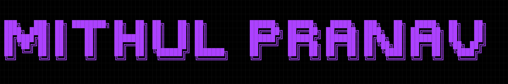

<div align="center">
  
</div>

<br />


```bash
mithul@m16r2:~/stack$ cat languages_and_scripting.txt
```
        

```bash
mithul@m16r2:~/stack$ ./init_ai_models.sh --start
```
    

```bash
mithul@m16r2:~/stack$ ./forge --target=frameworks --env=production
```

   

```bash
mithul@m16r2:~/stack$ kubectl get pods -n devops_and_orchestration
```
      

```bash
mithul@m16r2:~/stack$ cat stack.txt | grep "cloud and networking"
```
    

```bash
mithul@m16r2:~/stack$ ls /usr/bin/3d_design_tools
```
   

